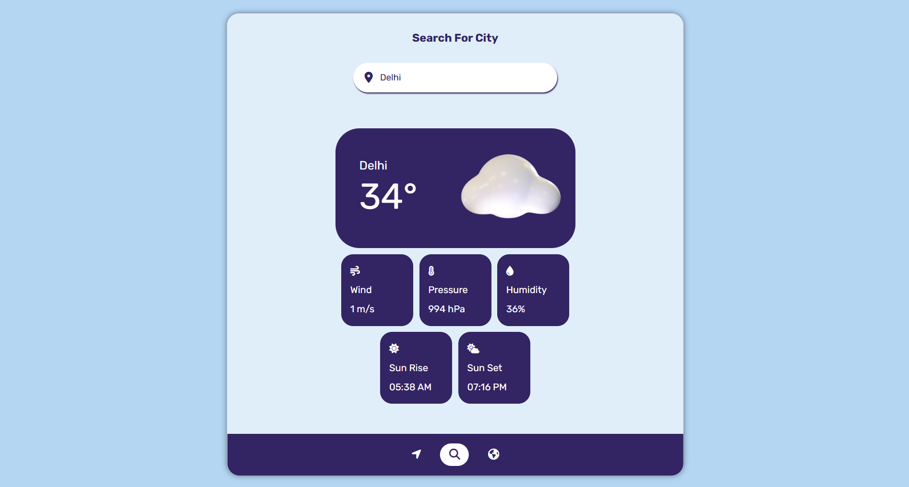

# 🌤️ Weather App

A simple and responsive **Weather App** built using **HTML**, **CSS**, and **JavaScript**. It fetches real-time weather data for any city using an open weather API and displays current conditions like temperature, humidity, and weather description.

## 🚀 Features

- 🌍 Search weather by city name  
- 🌡️ Displays current temperature, weather conditions, humidity, and wind speed  
- 🕒 Real-time data using weather API  
- 📱 Responsive design for mobile and desktop  
- 🎨 Clean and minimal user interface  

## 🛠️ Tech Stack

- **HTML** – Structure of the app  
- **CSS** – Styling and responsive design  
- **JavaScript** – Logic and API integration  
- **Weather API** – (e.g., OpenWeatherMap) for real-time data

### Desktop View


---

## 🛠️ Tech Stack Used

| Technology            | Purpose                                                                 |
|------------------------|-------------------------------------------------------------------------|
| **HTML5**              | To structure the web page                                               |
| **CSS3**               | To style and design the UI responsively                                |
| **JavaScript (Vanilla JS)** | To handle logic, fetch weather data via API, and update UI dynamically |
| **OpenWeatherMap API** | To fetch real-time weather data based on city name                     |

---

## 🔧 Setup Instructions

1. Clone the repository:
   ```bash
   git clone https://github.com/your-username/weather-app.git
2. Navigate to the project folder:
   ```bash
   cd weather-app
3. Open index.html in your browser.

# 🔑 API Key Setup
This app uses the OpenWeatherMap API. Follow these steps:

Go to OpenWeatherMap and sign up.

Get your API key from the dashboard.

Replace the placeholder YOUR_API_KEY in the JavaScript file with your actual API key:

```bash
let apiKey = "YOUR_API_KEY";
